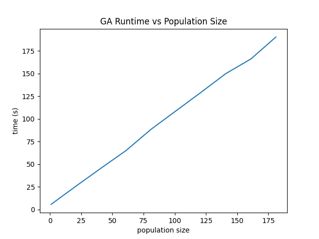
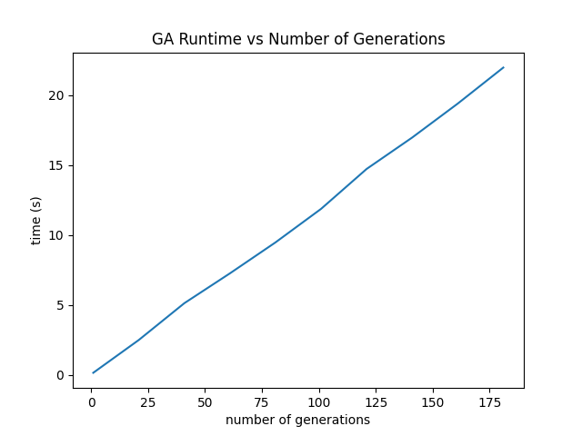

# An Evolutionary Approach to Timetabling

## Introduction

We constructed an easy to use study scheduling tool to assist students in managing their homework. It is based around genetic algorithm techniques, which are a subclass of evolutionary algorithm.

## Background

Evolutionary algorithms are different from raw implementations of solutions, and are a subset of optimization problems that derive strategies from
real world speciation and evolution. As opposed to building globally-optimal strategies or combining locally-optimal ones, evolutionary algorithms
adjust and adapt their current solutions over many generations to best fit some pre-defined desired goal. The process is intended to follow
evolutionary theory, where a species adapts its genepool over time to best match environmental conditions and maximize liklihood of survival.

Genetic algorithms phrase solution-finding in terms of those natural adaptive strategies, like gene mutation and natural selection. The solutions, which
are all progressive generations on some defined common ancestor, are ranked based on their position in some "fitness landscape." In the nature, the
fitness function is most often the liklihood to survive and procreate. In the case of homebrew algorithms that fitness could be anything, like
"how far a robot moves before falling."

These differ from typical gradient descent or astar path finding algorithms (See [@amit-astar]) in that we are not evaluating a gradient in order to determine a direction to move towards, but simply trusting that evolutionary processes will result in a fitness improvement.

In *similarity* to path finding algorithms, this process is done through heuristic methods which find approximations of a solution (See [@amit-heuristic] and [@heuristics] for more.)

## Problem Space

We chose to study the details and implementation surrounding homework scheduling. This scheduler is a continuation of a previous effort of the authors of a meeting scheduling application called LetsShedIt [^1] We implemented a simple genetic homework scheduling system which assists students in optimizing when to study. It can be difficult to balance NINJA hours, class due dates, and lengthy assignments, but using a heuristic-based schedule in the context of time, we will try and give suggestions for how to improve the studying experience. Parameters to our weighting system could includes due dates for specific homework, time entry from the users, when class is happening, ninja-hours optimization, and desired sleeping hours. 

We see parallels to the knapsack and other pathfinding problems, and also in
concepts used in CPU scheduling. Timetabling is also a very defined homework space in regards to university class scheduling methods, where improving the efficiency and optimality of solutions is important and increasingly complex.

[^1]: <https://github.com/thearchitector/LetsSchedIt/tree/gh-pages>

## Design Process

We first thought to use a path finding heuristic setup. We used Amit Patel's fabulous pathfinding website [@amit-astar] for help building our foundational knowledge on heuristic-based path finding. They have another page on the site, found at [@amit-heuristic] which we used to learn more about heuristics in-depth in order to figure out how we may be able to adapt it to our own algorithm.

We eventually found the technique of genetic algorithms promising, so we dove into that. We used established crossover and mutation techniques [@tournament] found through research to construct a model for our system and evolve it.

We decided that segmenting our problem into discrete blocks would be the first step to solving it. Each day is divided into half-hour blocks which is the level of fidelity we are solving the problem at. We figured that this would be sufficient due to most classes (at Olin) fitting into roughly half-hour increments. It would also simplify mutating and crossing solutions into a very defined list of temporal possibilities.

Topics to cover  
* csv importing design  
* ninja, course, assignment(homework), todo distinction  
* fitness function implementation and design  
* cross over design  
* mutation design  

To facilitate our testing, we created infrastructure import data into the system. The program loads from three CSV files (for course assistance hours, courses, and homework assignments.) Assignments as a construct don't inherently have a time associated with them (i.e. a block of time to complete them in), so we created a TODO class representation which is essentially an assignment with a time frame associated with it.

With that wrapper, we're able to put a collection of TODOs into a set and crossover, mutate, and evolve the solution of the form of a set of TODOs. At every generation, we perform crossover and mutation operations.

## Examination & Results

We ran an experiment to determine the temporal runtime performance of the application through a range of population sizes and iteration numbers.

* Plot of runtime data

The optimality of a solution produced by the program is determined by several factors specific to the homework scheduling constraints. For a particular homework, it should not be scheduled after or on its due date. Additionally, no homework should be scheduled during class times or other recreational periods (sleep, meals as represented in the model.) Our fitness function also prefers solutions which schedule solutions in the same time period as course assistant (NINJA) hours.

## Conclusions

We successfully implemented a homework scheduler using evolutionary techniques, and tested it across a number of input sizes for performance and optimality. The next steps for this application are runtime improvement based on data structure choices and integration into a more usable user interface such as a web application.

## References
