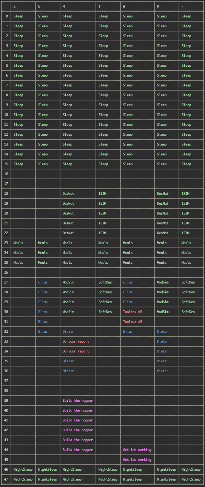

# An Evolutionary Approach to Timetabling

## Introduction

We constructed an easy to use study scheduling tool to assist students in managing their workloads thorughout the week. It makes use a genetic algorithm, which is a subclass of evolutionary algorithm, a series of compiled heuistics, and a list of know constraints to attempt and evolve an optimal agenda.

## Background

Evolutionary algorithms are different from raw implementations of solutions, and are a subset of optimization problems that derive strategies from real world speciation and evolution. As opposed to building globally-optimal strategies or combining locally-optimal ones, evolutionary algorithms adjust and adapt their current solutions over many generations to best fit some pre-defined goal. The process is intended to follow evolutionary theory, where a species adapts its genepool over time to best match environmental conditions and maximize liklihood of survival.

Genetic algorithms phrase solution-finding in terms of those natural adaptive strategies, like gene mutation and natural selection. The solutions, which are all progressive generations on some defined common ancestor, are ranked based on their position in some fitness landscape. In nature, the function that defines that landscape most often takes the form of "likelihood to survive and procreate". In the case of homebrew algorithms, that fitness function can be defined as any numerical representation of success, like "how far a robot moves before falling."

These differ from typical gradient descent or A* path finding algorithms (See [@amit-astar]), in that we are not evaluating a gradient in order to determine a direction to move towards. Rather, we are trusting that the evolutionary process will result in an improvement of fitness.

In *similarity* to path finding algorithms, however, this process is done through heuristic methods to find approximations of the optimality of given solutions (See [@amit-heuristic] and [@heuristics] for more.)

## Problem Space

We chose to study the details and implementation surrounding homework scheduling. This scheduler is a continuation of a previous project of ours, a meeting scheduling application called Let's Sched It [^1]. We implemented a simple genetic homework scheduling system to assist students in optimizing when to study and complete their assignments. It can be difficult to balance NINJA hours, class time, and lengthy assignments; using a heuristic-based schedule in the context of time, we tried to ease that process by generating suggestions for how one could approach their work. Parameters to our weighting system include the due dates for specific homework, completion time estimations from the user, class hours, NINJA (TA) hours, and desired sleeping hours.

We see parallels to the knapsack and other pathfinding problems, and also in concepts used in CPU scheduling. Timetabling is also a very defined homework space in regards to university class scheduling methods, where improving the efficiency and optimality of solutions is important and increasingly complex.

[^1]: <https://github.com/thearchitector/LetsSchedIt/tree/gh-pages>

## Design Process

We first thought to use a path finding heuristic setup. We used Amit Patel's fabulous pathfinding website [@amit-astar] to help build our foundational knowledge on heuristic-based path finding. We used another page on the site, found at [@amit-heuristic], to learn more about heuristics and figure out how we could adapt them for our own algorithm. After a while researching, we discovered genetic algorithms, which seemed both interesting and very promising. 

We decided that segmenting our problem into discrete blocks would be the first step to solving it. Each day is divided into half-hour blocks, which we figured would be sufficient as most classes (at Olin) fit into roughly half-hour increments.

To facilitate our testing, we created functions to allow our program to load data from three CSV files (course assistance hours, course schedules, and homework assignments). Also, we wanted the output of our algorithm to be a list of times during which we should complete those loaded assignments. To reflect that we created a class to store information about specific assignments as well as the times to complete them.

Knowing we would be dealing with a list of TODOs, we implemented several established crossover and mutation techniques found through research. Before breeding two soultions, we had to establish a robust way of selecting viable parents. We opted for an approach known as tournament selection (TS). In essence, TS selects the fittest solution from a subsample of size `k` from the parent population. We decided on a value of `k=3`, making our selection process an implementation of Ternary Tournament Selection (TTS). There is a significant amount of literature devoted to selecting appropriate values of `k`, all of which helped inform our decision [@tournament].

For our crossover (breeding) function, we implemented single-point crossover (SPX). SPX simply picks a random spot between both parents, splits them at it, and then recombines them in an alternating order to create a unique child. As before, there are many options for crossover algorithms, but our research seemed to indicate that SPX adequately and efficiently provided viable solutions.

Mutations are perhaps the most critical step in the entire process of genetic evolution, as they allow children to evolve properties that they might not get from either of their parents. That genetic variation provided a much larger search space over which our fitness function could evaluate solutions, and therefore significantly increased the success of an evolved solution. When designing our mutations, we had to come up with possible ways in which a given solution(s) could gain or lose traits. After thinking, we settled on a list of several possible mutations:
* swapping the completion day of two distinct solutions
* swapping the completion time of two distinct solutions
* randomly altering the start/end time of a random solution

## Results

We successfully implemented a homework scheduler using the functions above, which yieled fairly promising results. Our entire program was able to generate a solution with no conflicts with existing classes and no overdue assignments.

### Experiment

We also ran an experiment to determine the real runtime performance of the application through a range of population and generation sizes. Interestingly, the runtime of our algorithm remained constant with a given problem no matter the population size or number of generations.

## Conclusions

We're really happy with how our project turned out. It finds optimal-looking solutions regularly, and appears to be quite robust and adaptive to a wide range of input constraints. As a set of next steps, we might improve its runtime by selecting and utilizing more efficient data structures, as well as integrate it into a into a more usable user interface (like a separate web application or Let's Sched It.)

## References
